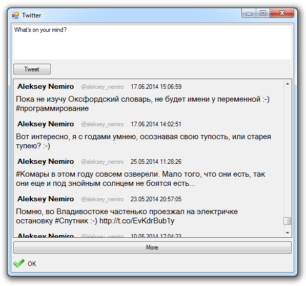

This is a sample application for **Twitter**.

This application allows you to view and publish tweets.

Working with **Twitter API** is carried out using the library **Nemiro.OAuth**.

To work with **API** used access token, which is obtained after the user's authorization.

The access token is saved into the application settings and there is no need to authorize the user constantly.

This application **Windows Forms**.
The source code is written in **Visual Basic .NET**.

The application is licensed under the **Apache License Version 2.0**.